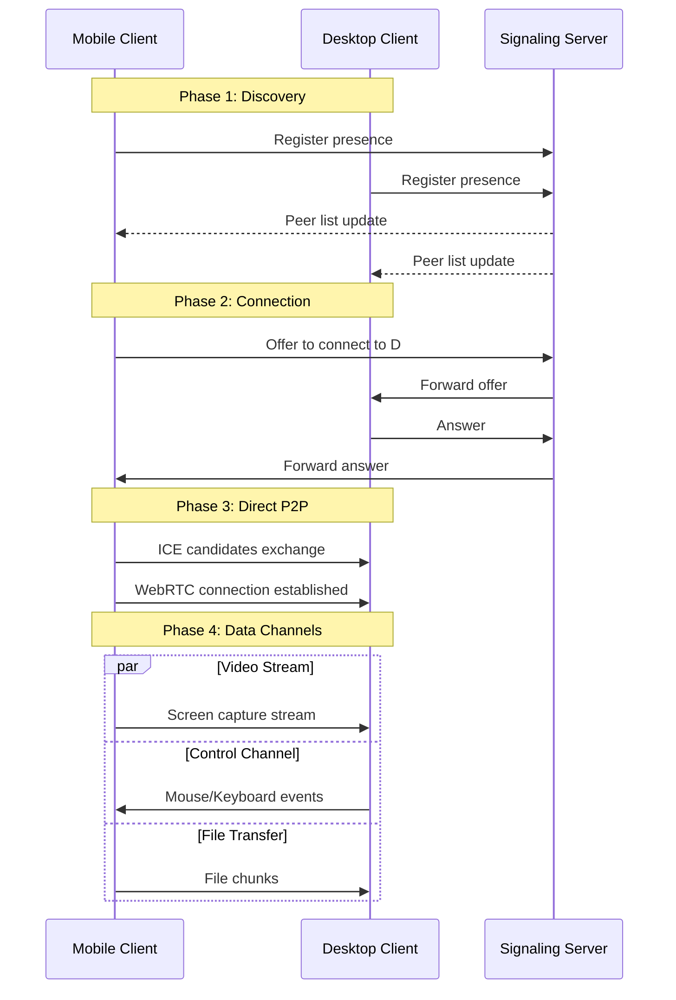
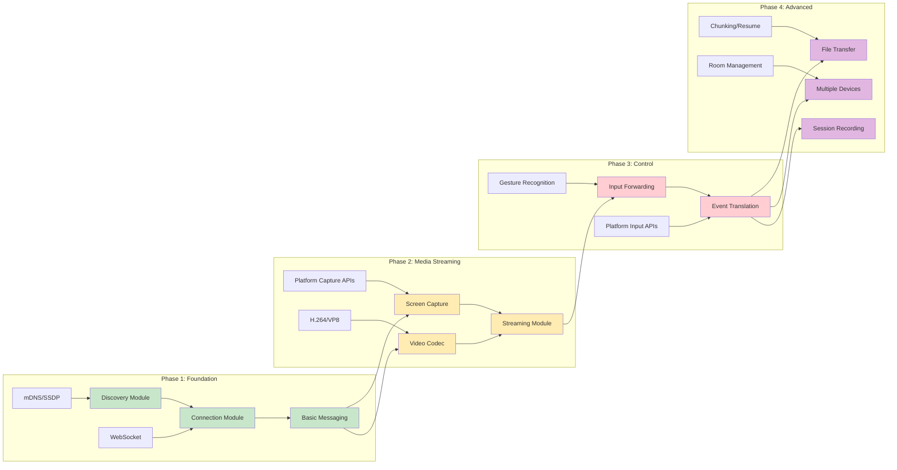
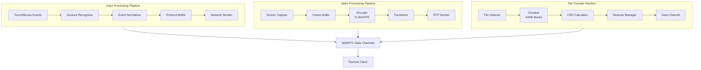
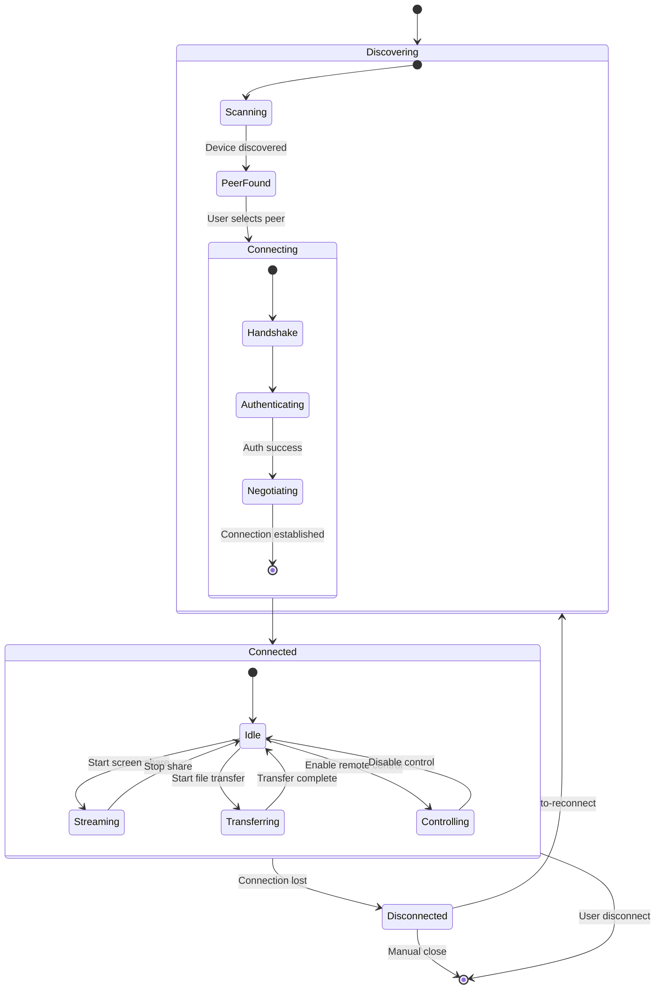
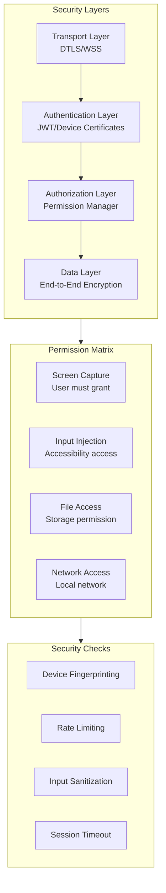
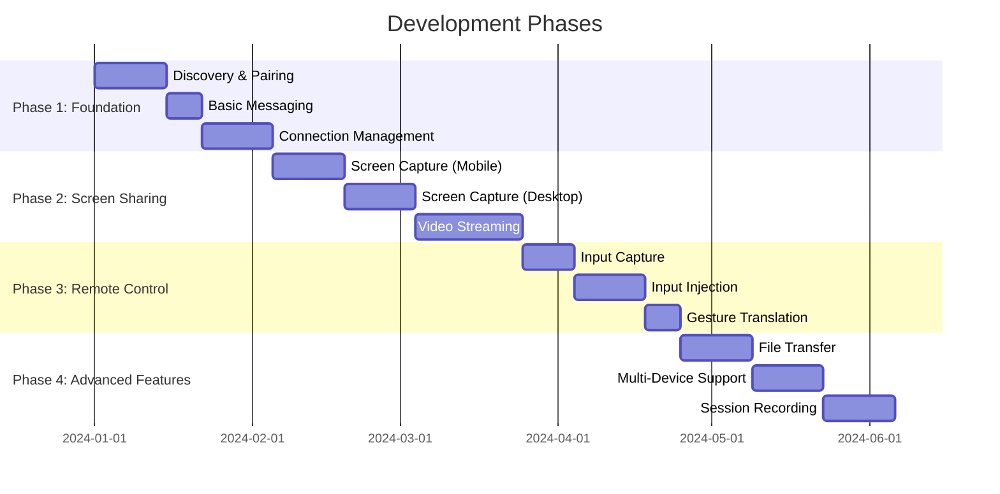

# 🌙 Vellichor

*Where screens drift between devices*

Vellichor is a cross-device control application that allows you to share screens and control devices between your phone and laptop bidirectionally.

## ✨ Features

- 🔍 **Device Discovery** - Automatically find devices on your local network
- 📱 **Screen Sharing** - View your phone screen on laptop and vice versa
- 🎮 **Remote Control** - Control devices from either end
- 📁 **File Transfer** - Seamlessly share files between devices
- 🔒 **Secure** - End-to-end encrypted communication

## 🚀 Getting Started

### Prerequisites
- Node.js 18+
- npm 9+
- React Native development environment
- For desktop: Windows SDK or Xcode (depending on platform)

### Installation

```bash
# Clone and enter project
git clone https://github.com/yourusername/vellichor.git
cd vellichor

# Run initialization script
chmod +x init-vellichor.sh
./init-vellichor.sh

# Install dependencies
npm run bootstrap

# Start development
npm run dev:mobile  # For mobile app
npm run dev:desktop # For desktop app
npm run dev:server  # For signaling server
```

## 📁 Project Structure
```shell
vellichor/
├── 📱 mobile/                    # React Native mobile app
│   ├── src/
│   │   ├── api/                  # API clients & services
│   │   │   ├── discovery/        # mDNS/SSDP device discovery
│   │   │   ├── signaling/        # WebSocket signaling client
│   │   │   ├── webrtc/           # WebRTC connection management
│   │   │   └── filetransfer/      # File transfer protocols
│   │   │
│   │   ├── components/
│   │   │   ├── common/           
│   │   │   │   ├── Button/
│   │   │   │   ├── Input/
│   │   │   │   └── Modal/
│   │   │   ├── discovery/
│   │   │   │   ├── DeviceList/
│   │   │   │   ├── PairingModal/
│   │   │   │   └── ConnectionStatus/
│   │   │   ├── streaming/
│   │   │   │   ├── ScreenViewer/
│   │   │   │   ├── QualityControl/
│   │   │   │   └── PiPView/
│   │   │   ├── control/
│   │   │   │   ├── Touchpad/
│   │   │   │   ├── Keyboard/
│   │   │   │   └── GestureOverlay/
│   │   │   └── files/
│   │   │       ├── FileBrowser/
│   │   │       ├── TransferProgress/
│   │   │       └── History/
│   │   │
│   │   ├── hooks/
│   │   │   ├── useDiscovery.ts
│   │   │   ├── useWebRTC.ts
│   │   │   ├── useScreenCapture.ts
│   │   │   ├── useInputInjection.ts
│   │   │   ├── useFileTransfer.ts
│   │   │   └── useConnection.ts
│   │   │
│   │   ├── screens/
│   │   │   ├── Home/
│   │   │   ├── Discovery/
│   │   │   ├── Connection/
│   │   │   ├── ScreenShare/
│   │   │   ├── RemoteControl/
│   │   │   ├── FileTransfer/
│   │   │   └── Settings/
│   │   │
│   │   ├── services/
│   │   │   ├── webrtc/
│   │   │   │   ├── WebRTCService.ts
│   │   │   │   ├── SignalClient.ts
│   │   │   │   └── PeerConnectionFactory.ts
│   │   │   ├── discovery/
│   │   │   │   ├── MDNSDiscovery.ts
│   │   │   │   └── SSDPDiscovery.ts
│   │   │   ├── capture/
│   │   │   │   ├── ScreenCaptureService.ts (native module bridge)
│   │   │   │   └── FrameProcessor.ts
│   │   │   ├── input/
│   │   │   │   ├── InputCaptureService.ts
│   │   │   │   └── InputInjector.ts (native module bridge)
│   │   │   └── storage/
│   │   │       ├── FileStorage.ts
│   │   │       └── SettingsStore.ts
│   │   │
│   │   ├── store/
│   │   │   ├── slices/
│   │   │   │   ├── connectionSlice.ts
│   │   │   │   ├── deviceSlice.ts
│   │   │   │   ├── streamSlice.ts
│   │   │   │   └── transferSlice.ts
│   │   │   ├── middlewares/
│   │   │   │   └── websocketMiddleware.ts
│   │   │   └── index.ts
│   │   │
│   │   ├── utils/
│   │   │   ├── constants.ts
│   │   │   ├── helpers.ts
│   │   │   ├── validators.ts
│   │   │   ├── codecs.ts
│   │   │   └── logger.ts
│   │   │
│   │   ├── types/
│   │   │   ├── api.types.ts
│   │   │   ├── device.types.ts
│   │   │   ├── stream.types.ts
│   │   │   ├── native.types.ts
│   │   │   └── global.d.ts
│   │   │
│   │   └── native/
│   │       ├── android/
│   │       │   ├── src/main/java/com/vellichor/
│   │       │   │   ├── ScreenCaptureModule.java
│   │       │   │   ├── InputInjectorModule.java
│   │       │   │   └── FilePickerModule.java
│   │       │   └── build.gradle
│   │       └── ios/
│   │           ├── Vellichor/
│   │           │   ├── ScreenCaptureModule.m
│   │           │   ├── InputInjectorModule.m
│   │           │   └── FilePickerModule.m
│   │           └── Podfile
│   │
│   ├── __tests__/
│   ├── android/
│   ├── ios/
│   ├── package.json
│   ├── tsconfig.json
│   ├── metro.config.js
│   └── app.json
│
├── 💻 desktop/                   # Electron desktop app
│   ├── src/
│   │   ├── main/
│   │   │   ├── index.ts         # Electron main process
│   │   │   ├── ipc/
│   │   │   ├── menu/
│   │   │   └── windows/
│   │   ├── renderer/
│   │   │   ├── components/
│   │   │   ├── hooks/
│   │   │   ├── screens/
│   │   │   ├── store/
│   │   │   └── App.tsx
│   │   ├── native/
│   │   │   ├── win32/
│   │   │   │   ├── ScreenCapture.cpp
│   │   │   │   ├── InputInjector.cpp
│   │   │   │   └── dllmain.cpp
│   │   │   └── macos/
│   │   │       ├── ScreenCapture.m
│   │   │       └── InputInjector.m
│   │   └── shared/               # Shared with mobile
│   │       ├── types/
│   │       └── utils/
│   │
│   ├── resources/
│   ├── package.json
│   ├── tsconfig.json
│   ├── webpack.config.js
│   └── forge.config.js
│
├── 🌐 server/                    # Signaling server
│   ├── src/
│   │   ├── controllers/
│   │   │   ├── signalingController.ts
│   │   │   ├── roomController.ts
│   │   │   └── healthController.ts
│   │   ├── services/
│   │   │   ├── RoomManager.ts
│   │   │   ├── PeerManager.ts
│   │   │   └── DiscoveryService.ts
│   │   ├── middleware/
│   │   │   ├── auth.ts
│   │   │   ├── rateLimit.ts
│   │   │   └── validation.ts
│   │   ├── models/
│   │   │   ├── Room.ts
│   │   │   └── Peer.ts
│   │   ├── utils/
│   │   ├── types/
│   │   └── app.ts
│   │
│   ├── docker/
│   │   ├── Dockerfile
│   │   └── docker-compose.yml
│   ├── package.json
│   ├── tsconfig.json
│   └── .env.example
│
├── 📦 shared/                    # Shared code across all
│   ├── constants/
│   │   ├── protocols.ts
│   │   └── events.ts
│   ├── types/
│   │   ├── messages.ts
│   │   └── payloads.ts
│   └── utils/
│       ├── crypto.ts
│       └── encoding.ts
│
├── 📚 docs/
│   ├── architecture/
│   ├── api/
│   ├── protocols/
│   └── development/
│
├── 🧪 e2e/
│   ├── mobile/
│   └── desktop/
│
├── 📦 scripts/
│   ├── setup-dev.sh
│   ├── build-all.sh
│   └── deploy.sh
│
├── .gitignore
├── .eslintrc.js
├── .prettierrc
├── .editorconfig
├── lerna.json
├── package.json
└── README.md
```

## Architecture
### 🏗️ High-Level System Architecture

```mermaid
graph TB
    subgraph "Mobile Client (React Native)"
        A[UI Layer<br/>React Components] --> B[State Management<br/>Redux/Context]
        B --> C[Core Services Layer]
        
        subgraph C [Core Services]
            C1[Discovery Service]
            C2[Connection Manager]
            C3[Streaming Service]
            C4[Input Handler]
            C5[File Transfer Service]
        end
        
        subgraph D [Native Modules]
            D1[Screen Capture<br/>Android: MediaProjection<br/>iOS: ReplayKit]
            D2[Input Injection<br/>Android: AccessibilityService<br/>iOS: -]
            D3[File System Access]
            D4[Network Info]
        end
        
        C --- D
    end
    
    subgraph "Desktop Client (Electron/Node)"
        E[UI Layer<br/>React/Electron] --> F[State Management]
        F --> G[Core Services Layer]
        
        subgraph G [Desktop Services]
            G1[Discovery Service]
            G2[Connection Manager] 
            G3[Streaming Service]
            G4[Input Handler]
            G5[File Transfer Service]
        end
        
        subgraph H [Native Modules]
            H1[Screen Capture<br/>Windows: DXGI<br/>Mac: CGDisplayStream]
            H2[Input Injection<br/>Windows: SendInput<br/>Mac: CGEventCreate]
            H3[File System Access]
        end
        
        G --- H
    end
    
    subgraph "Backend Services"
        I[Signaling Server<br/>Node.js/Socket.io]
        J[STUN/TURN Servers<br/>coturn]
        K[Discovery Service<br/>mDNS/SSDP]
    end
    
    Mobile Client <--> Backend Services
    Desktop Client <--> Backend Services
    Mobile Client <-.-> Desktop Client
    
    style A fill:#e1f5fe
    style E fill:#e1f5fe
    style I fill:#fff3e0
    style J fill:#fff3e0
    style K fill:#fff3e0
```

---

## Communication Protocol Architecture



---

## 📦 Feature Modules & Dependencies



---

## 📊 Data Flow Architecture



---

## 🗄️ State Management Architecture



---

## 🧩 Module Responsibility Matrix

| Module | Responsibility | Platform-Specific | Dependencies | Phase |
|--------|---------------|-------------------|--------------|-------|
| **Discovery** | Find peers on network | mDNS (Bonjour), SSDP | Network permissions | 1 |
| **Connection** | Establish P2P link | WebRTC implementation | Signaling server | 1 |
| **Screen Capture** | Capture device screen | MediaProjection, ReplayKit, DXGI | Android 5+, iOS 12+, Win 8+ | 2 |
| **Video Encoder** | Compress video stream | H.264 hardware encoding | WebRTC | 2 |
| **Input Capture** | Capture user input | Touch/Keyboard/Mouse events | Accessibility permissions | 3 |
| **Input Injection** | Simulate input remotely | SendInput, CGEventCreate | Admin/root on some platforms | 3 |
| **File Transfer** | Send files between devices | File system access | Data channels | 3 |
| **Session Manager** | Handle multiple connections | None | Connection module | 4 |

---

## 🔒 Security Architecture



---

## 📈 Performance Benchmarks & Constraints

| Component | Target | Minimum | Constraint |
|-----------|--------|---------|------------|
| **Video Latency** | <100ms | <200ms | Network dependent |
| **Input Latency** | <50ms | <100ms | Critical for usability |
| **Stream Resolution** | 720p | 480p | Bandwidth adaptive |
| **Frame Rate** | 30fps | 15fps | CPU/GPU limited |
| **File Transfer** | 10MB/s | 1MB/s | WiFi direct/LAN |
| **Battery Impact** | <10%/hr | <20%/hr | Screen capture heavy |
| **Memory Usage** | <200MB | <500MB | Mobile constraints |

---

## 🚦Development Roadmap & Milestones



---

## Scope Creep Prevention Checklist

### Must Have (MVP)
- [ ] Local network device discovery
- [ ] One-way screen viewing (phone → laptop)
- [ ] Basic touch/mouse forwarding
- [ ] Simple file transfer

### Should Have (Phase 2)
- [ ] Bi-directional screen sharing
- [ ] Keyboard input support
- [ ] Clipboard sync
- [ ] Connection encryption

### Could Have (Phase 3)
- [ ] Multiple simultaneous connections
- [ ] Session recording
- [ ] Gesture customization
- [ ] Remote wake-on-LAN

### Won't Have (Out of Scope)
- [ ] Internet-based remote access (beyond LAN)
- [ ] Full OS control (system settings)
- [ ] Audio streaming
- [ ] Third-party cloud storage integration

---
